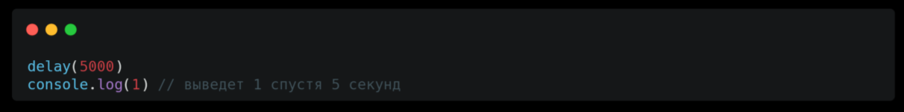
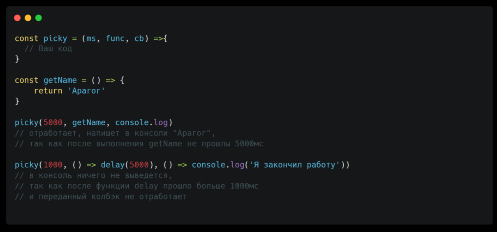
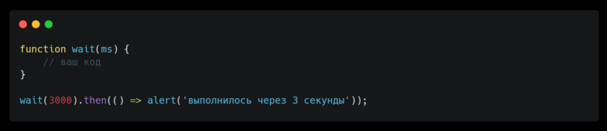
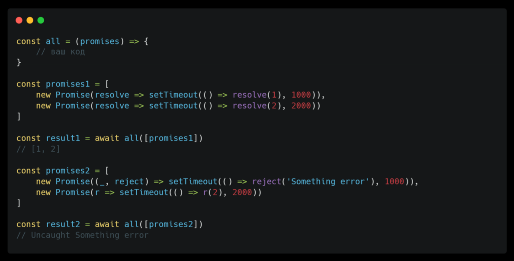
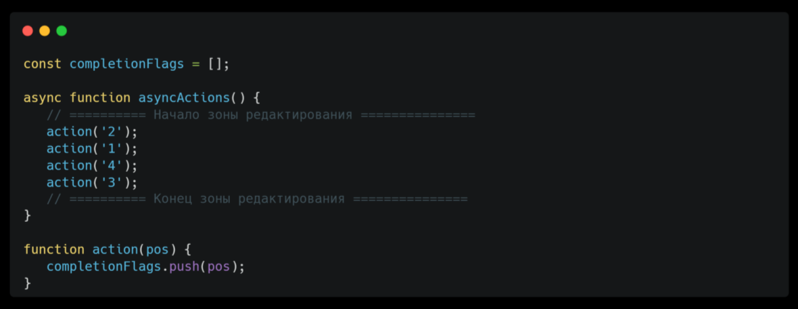

# Red Collar Frontend School 2023, Homework №3. Asynchronous JavaScript.

### Задача №1

Создайте функцию задержки потока `delay()`, которая принимает время в миллисекундах и не даёт выполняться другим задачам. Для подсчёта времени, вам может помочь встроенный объект `Date`

### Задача №2

Вам попался очень придирчивый клиент. Если какие-то функции выполняются слишком долго, то их результат уже не нужен. Создайте функцию `picky()`, которая будет принимать 3 аргумента - время актуальности значений функции в миллисекундах; функцию, значение которой нужно получить; колбэк, который примет результат функции и сработает, если результат ещё актуален

### Задача №3

Встроенная функция `setTimeout()` использует колбэк-функции. Создайте альтернативу, использующую промисы. Создайте функцию `wait()`, которая должна возвращать промис, который перейдет в состояние «выполнен» через ms миллисекунд, так чтобы мы могли добавить к нему `.then`

### Задача №4

На лекции мы рассмотрели один из методов **Promise API**, который позволяет дождаться выполнения всех промисов - `Promise.all`. Повторите его поведение, создав функцию `all()`. Функция принимает массив из промисов `promises[]`, и возвращает один промис, который завершится после выполнения всех promises. В возвращенном промисе результаты
хранятся в виде массива.

Что нужно учесть при реализации:
- Порядок элементов в массиве результата в точности соответствует порядку исходных промисов
- Если любой из промисов завершится с ошибкой, то промис, возвращенный функцией `all()`, немедленно завершается с этой ошибкой

### Задача №5

Перепишите громоздкую функцию `getPageInformation()`, используя цепочки промисов или `async await`. В консоль должен выводиться объект со всеми полученными данными (код функции прилагается в файле 5.js)

### Задача №6

Используя только средства асинхронного выполнения (`setTimeout, Promise, queueMicrotask`) и не изменяя вертикальный порядок вызова функций 2, 1, 4, 3 в исходном коде, внесите изменения в код таким образом, чтобы после полного завершения выполнения программы в массиве `completionFlags[]` содержалась последовательность ['1' , '2', '3', '4']. При использование `setTimeout` разрешается использовать только нулевую задержку. Для решение задачи поможет рассмотренная тема про микро и макро задачи и про их приоритет выполнения
(код функции прилагается в файле 6.js)

